# Unturned Server Manager

<div align="center">

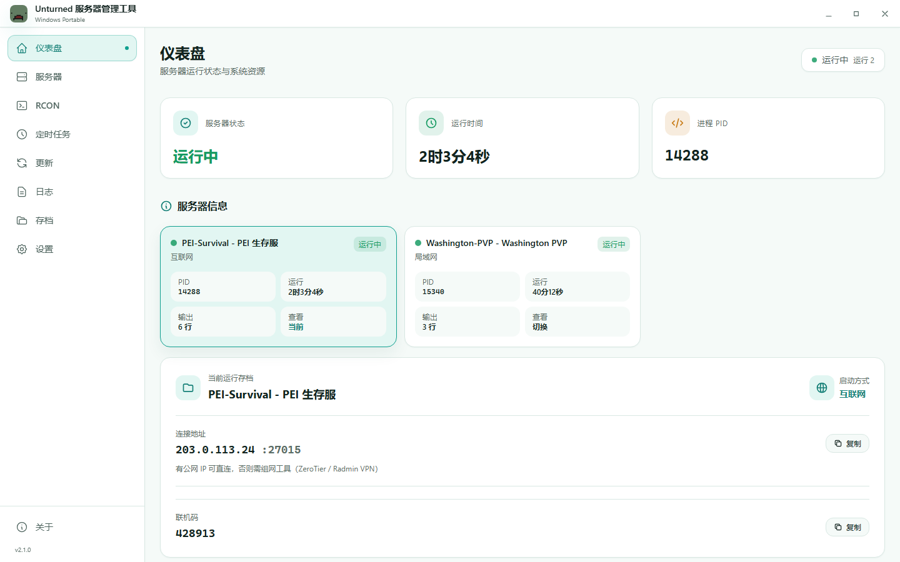

**清新、轻量、便携的 Unturned 专用服务器管理工具**

基于 **Tauri v2 + Svelte 5 + Rust** 构建，把服务端启动、RCON、存档、创意工坊模组、插件、更新、日志和定时任务集中到一个现代化桌面面板里。


</div>

## 界面预览

### 仪表盘

<p align="center">
  
</p>

### 核心工作流

<table>
  <tr>
    <td width="50%">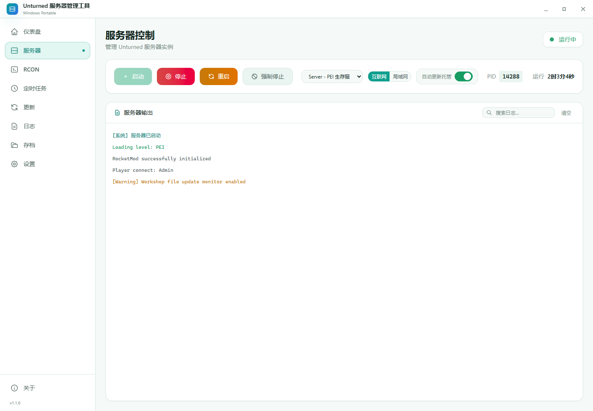</td>
    <td width="50%">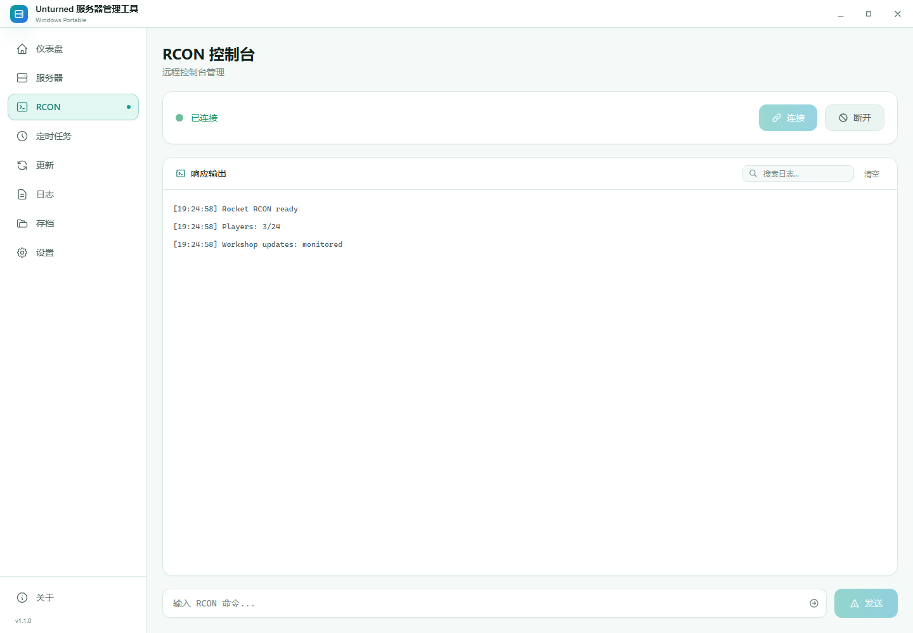</td>
  </tr>
  <tr>
    <td align="center">服务器控制</td>
    <td align="center">RCON 控制台</td>
  </tr>
  <tr>
    <td width="50%">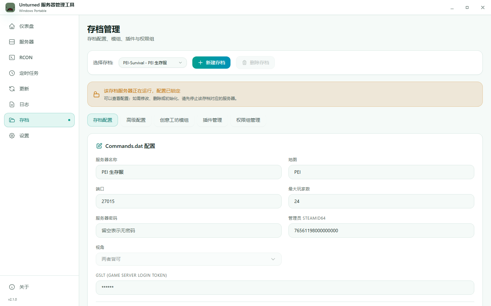</td>
    <td width="50%">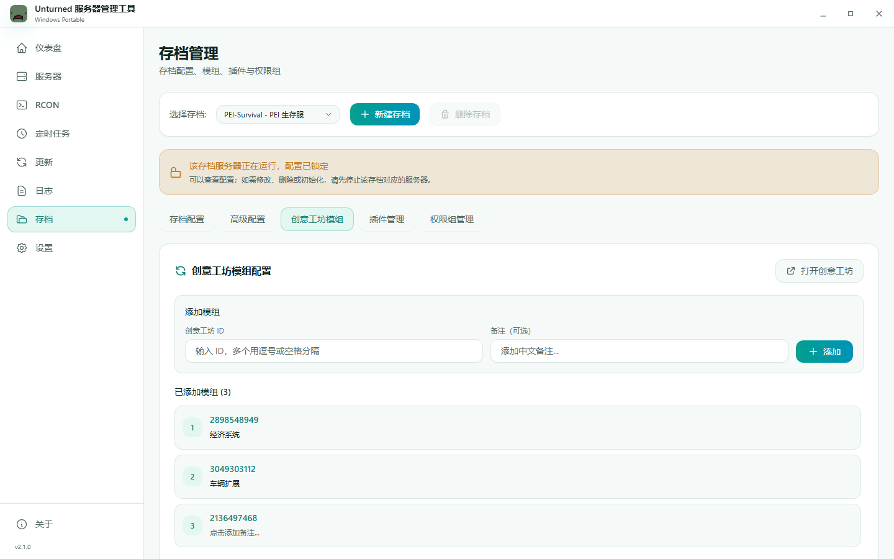</td>
  </tr>
  <tr>
    <td align="center">存档配置</td>
    <td align="center">创意工坊模组</td>
  </tr>
  <tr>
    <td width="50%">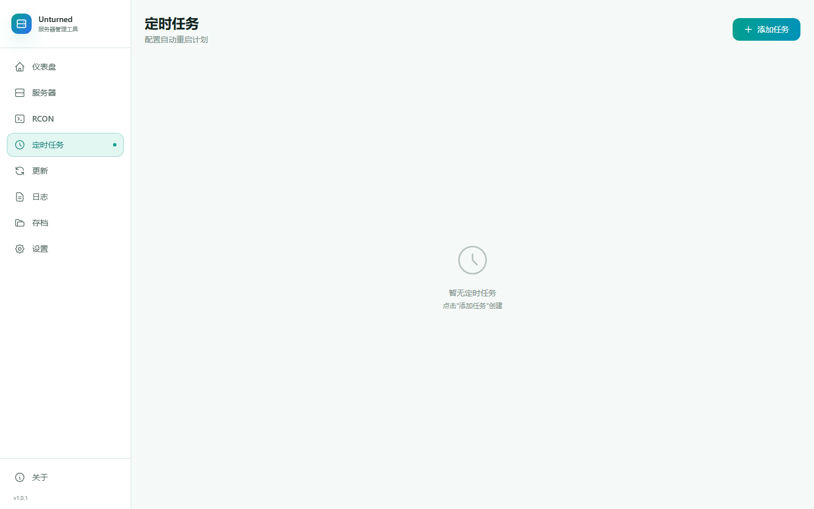</td>
    <td width="50%">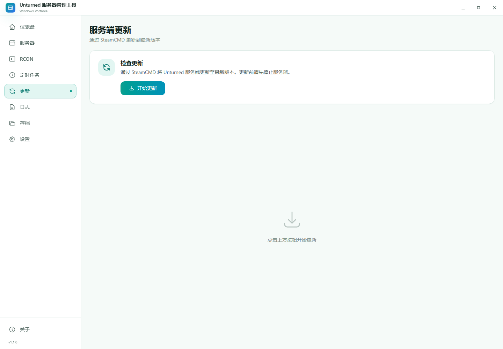</td>
  </tr>
  <tr>
    <td align="center">定时任务</td>
    <td align="center">服务端更新</td>
  </tr>
  <tr>
    <td width="50%">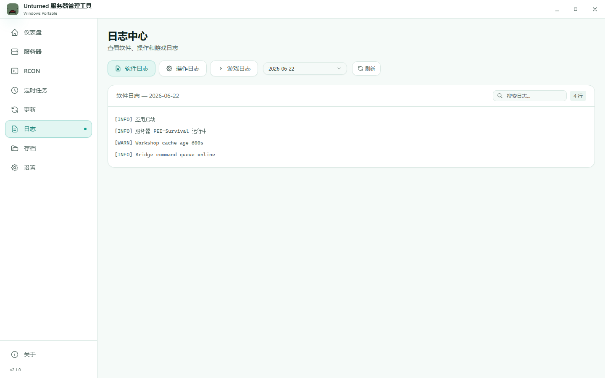</td>
    <td width="50%">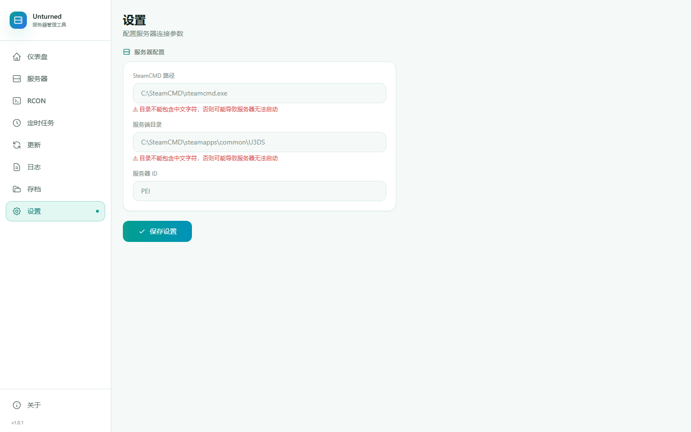</td>
  </tr>
  <tr>
    <td align="center">日志中心</td>
    <td align="center">设置</td>
  </tr>
</table>

### 首次引导

<table>
  <tr>
    <td width="70%">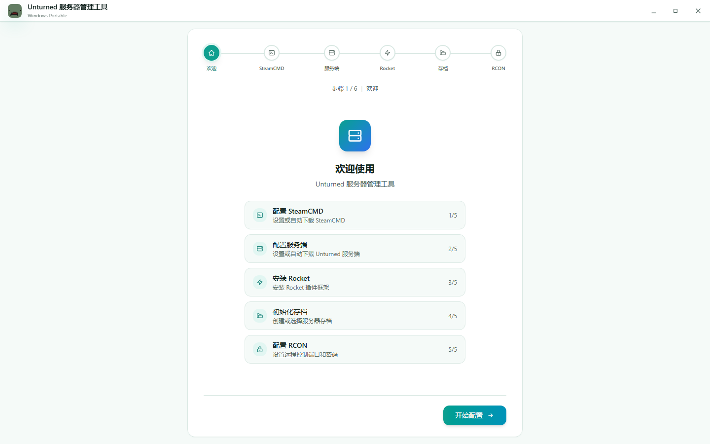</td>
    <td width="30%">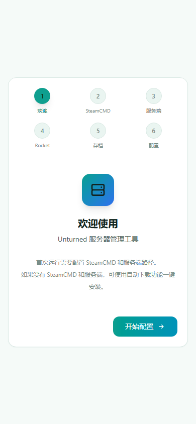</td>
  </tr>
  <tr>
    <td align="center">桌面端引导</td>
    <td align="center">窄屏响应式引导</td>
  </tr>
</table>

## 功能亮点

| 模块 | 能力 |
| --- | --- |
| 仪表盘 | 查看服务器状态、PID、运行时间、CPU、内存、网络流量，并可快速启动、停止、重启服务器 |
| 服务器控制 | 一键启动、停止、重启、强制停止，支持实时输出、日志搜索、局域网/互联网模式切换 |
| RCON 控制台 | 连接 Rocket RCON、发送命令、轮询响应，服务器启动后可自动连接 |
| 存档配置 | 管理 `Commands.dat`、Rocket RCON、PvE、作弊、GSLT、地图、端口和最大玩家数 |
| 创意工坊模组 | 维护 `WorkshopDownloadConfig.json`，管理模组 ID、备注、缓存下载、更新监控和关服提示 |
| 插件管理 | 查看 Rocket 插件目录，保存插件备注，快速打开插件配置目录 |
| 日志中心 | 查看软件日志、操作日志和游戏日志，支持日期切换、分类筛选和搜索 |
| 服务端更新 | 调用 SteamCMD 更新 Unturned 服务端，并显示更新输出 |
| 定时任务 | 创建每日、每周、间隔型自动重启任务，支持提前提醒 |
| 首次引导 | 自动检测/下载 SteamCMD，安装 Rocket 模块，初始化存档和 RCON |

## 最近更新

- 新增创意工坊模组管理页，可编辑 `WorkshopDownloadConfig.json`。
- 新增模组备注、插件备注、日志中心和自动更新托管相关界面。
- 强化打开创意工坊链接的校验，避免任意 URL 被执行。
- 优化高频日志/控制台输出路径，减少文件 I/O 和前端重复渲染。
- 全量刷新 README 截图与头图，匹配当前界面。

## 技术栈

| 层级 | 技术 |
| --- | --- |
| 桌面框架 | Tauri v2 |
| 前端 | Svelte 5、TypeScript、Tailwind CSS v4 |
| 后端 | Rust、Tauri commands |
| 构建 | Vite、pnpm、Cargo |
| 系统能力 | WebView2、sysinfo、reqwest、zip |

## 系统支持

| 系统版本 | 便携版 | 说明 |
| --- | --- | --- |
| Windows 11 | 支持 | 自带 WebView2，可直接运行 |
| Windows 10 21H2+ | 支持 | 自带 WebView2，可直接运行 |
| Windows 10 1803 - 21H1 | 支持 | 需要安装 WebView2 Runtime |
| Windows Server 2022 | 支持 | 可直接运行 |
| Windows Server 2016/2019 | 支持 | 需要安装 WebView2 Runtime |
| Windows 7/8/8.1 | 不支持 | WebView2 与运行环境不满足要求 |

> macOS 与 Linux 当前未提供预构建包，需要自行编译。

## 快速开始

```bash
pnpm install
pnpm tauri dev
```

生产构建：

```bash
pnpm tauri build
```

构建完成后会生成：

```text
src-tauri/target/release/unturned-server-manager.exe
src-tauri/target/release/bundle/nsis/Unturned Server Manager_2.0.0_x64-setup.exe
```

## 便携版

直接运行下面这个文件即可，无需安装：

```text
src-tauri/target/release/unturned-server-manager.exe
```

程序会在运行目录下自动创建运行数据：

```text
config/      应用配置、服务器配置、定时任务、备注数据
logs/        应用日志、操作日志、游戏日志
data/        运行数据
backups/     备份数据
```

## 公网安全

打包后的桌面管理界面不会启动可被公网访问的 Web 服务，别人不能通过 `服务器IP:1420` 打开这个软件界面。开发模式和预览模式固定监听 `127.0.0.1`，只允许本机访问。

需要区分的是 Unturned 游戏端口和 Rocket RCON 端口：游戏端口通常需要按开服需求放行；RCON 是管理端口，不建议对公网开放。建议在 Windows 防火墙或云服务器安全组中只放行游戏端口，阻止 RCON 端口的公网入站访问，并使用强随机 RCON 密码。

## 项目结构

```text
src/
  App.svelte              主壳层、窗口栏与导航
  app.css                 全局主题与响应式样式
  lib/pages/
    Dashboard.svelte      仪表盘
    Server.svelte         服务器控制
    Rcon.svelte           RCON 控制台
    Save.svelte           存档、创意工坊模组与插件
    Schedule.svelte       定时任务
    Update.svelte         服务端更新
    Logs.svelte           日志中心
    Settings.svelte       设置
    Wizard.svelte         首次引导
    About.svelte          关于

src-tauri/
  src/commands/           Tauri 命令
  src/services/           配置、日志、进程、RCON、调度和系统监控服务
  src/models/             数据模型
  tauri.conf.json         Tauri 应用配置
```

## 开发要求

| 工具 | 建议版本 |
| --- | --- |
| Node.js | 22 或更高 |
| pnpm | 11 或更高 |
| Rust | 1.77.2 或更高 |
| Visual Studio Build Tools | C++ 桌面开发工作负载 |
| WebView2 Runtime | 旧版 Windows 需要手动安装 |

## 常见问题

### 构建提示 PowerShell 脚本被阻止

Windows 执行策略可能拦截 `pnpm.ps1`。可以使用：

```powershell
pnpm.cmd tauri build
```

### 旧版 Windows 打不开程序

请安装 Microsoft WebView2 Runtime，并确保已安装 Visual C++ Redistributable。

### 首次编译较慢

Rust release 构建会下载并编译依赖，首次耗时较长；后续构建通常会快很多。

## 相关链接

- [Unturned 官方服务器文档](https://docs.smartlydressedgames.com/en/stable/servers/)
- [Unturned Wiki Commands](https://unturned.wiki.gg/Commands)
- [Tauri v2 文档](https://v2.tauri.app/)
- [Svelte 文档](https://svelte.dev/)
